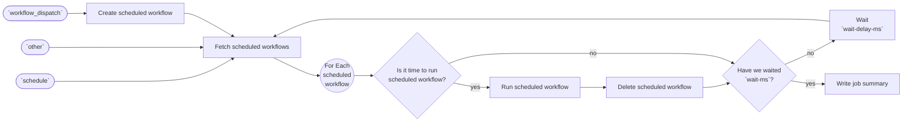

# 📅 Schedule Workflow Runs Action

Schedule your GitHub Actions workflows to run at a future date and time! 🤯

This works using the [`schedule`](https://docs.github.com/en/actions/using-workflows/events-that-trigger-workflows#schedule) event to poll GitHub variables which are used as our database for scheduling.

<details>
<summary>Flow Diagram</summary>



</details>

https://github.com/austenstone/schedule/assets/22425467/040aa351-cf1a-40e2-99e9-98de5de192bc

## Usage

Create a workflow (eg: `.github/workflows/schedule.yml`) and copy the [example](#-example) below. Ensure you've setup the [authentication](#-authentication) and [inputs](#%EF%B8%8F-inputs) correctly.

### 🔑 Authentication

#### GitHub App

* [Create a GitHub App](https://github.com/settings/apps/new?name=actions-scheduler&description=Schedule%20GitHub%20Actions%20runs.&url=https://github.com&public=false&actions=write&actions_variables=write&webhook_active=false) with the `actions` & `actions_variables` scope.
* Use the [actions/create-github-app-token](https://github.com/actions/create-github-app-token?tab=readme-ov-file#create-github-app-token) action to create a GitHub App token to generate a token.

#### Personal Access Token (PAT)

You need to create a Personal Access Token (PAT) with the `repo` scope and add it to your repository secrets.

##### Fine-grained access tokens

The token must have the following permission set:

* `actions_variables:write`
* `actions:write`

### ⏩ Example


This workflow runs on a [`schedule`](https://docs.github.com/en/actions/using-workflows/events-that-trigger-workflows#schedule) event every hour and spends <1min checking the schedule for any pending workflows to run.

To schedule a workflow, manually do a [`workflow_dispatch`](https://docs.github.com/en/actions/using-workflows/events-that-trigger-workflows#workflow_dispatch) by going to "Actions > 📅 Schedule Workflow Dispatch", type when you want the workflow to run, and click Run workflow.

#### Inputs

* Replace the `workflow` input with the name, path, or id of the workflow you want to run
* Change the `timezone` input to your timezone

> [!IMPORTANT]  
> Make sure you've set your PAT to the `TOKEN` secret in your repository settings.

```yml
name: 📅 Schedule Workflow Dispatch
on:
  schedule:
    - cron: '0 */1 * * *' # every hour
  workflow_dispatch:
    inputs:
      date:
        description: 'Date to run the workflow'
        required: true
        type: string
        default: 'in 1 hour'
concurrency:
  group: schedule${{ github.event.inputs.date }}
  cancel-in-progress: true

jobs:
  schedule:
    name: 📅 Schedule
    runs-on: ubuntu-latest
    steps:
      - uses: austenstone/schedule@v1.3
        with:
          github-token: ${{ secrets.TOKEN }}
          date: ${{ github.event.inputs.date }}
          workflow: 'basic.yml'
          timezone: 'US/Eastern' # US/Central, US/Pacific
          wait-ms: 45000
```

#### Timezone

The timezone is set to `EST` by default. You can change this to your timezone. EX: `US/Central`, `US/Pacific`, [etc](https://en.wikipedia.org/wiki/List_of_tz_database_time_zones).

```yml
          timezone: 'US/Eastern'
```

#### Changing when to check the schedule

The [`schedule`](https://docs.github.com/en/actions/using-workflows/events-that-trigger-workflows#schedule) event is used to check for scheduled workflow runs. You can change the cron to run at a different interval.

```yml
on:
  schedule:
    - cron: '0 */1 * * *'
```

The action also has the ability to continue running the workflow and polling for a specific amount of time. This is useful if you want to run the workflow at a specific time and then continue running the workflow for a specific amount of time.

In the example below we spend 5 minutes checking the schedule every 20 seconds:

```yml
        with:
          wait-ms: 300000 # Check for 5 minutes
          wait-delay-ms: 20000 # Wait 20 seconds between checks
```

> [!TIP]
> You may want to consider that for billing GitHub jobs are rounded up to the nearest minute.

#### Selecting the workflow to run

Pass in the workflow you want to run. This can be the name, path, or id of the workflow.

```yml
          workflow: 'basic.yml'
```

You could provide options for workflows to run. This does interfere with the workflow inputs you might want to pass in.

```yml

      workflow:
        description: 'Workflow to run at schedule time'
        required: true
        type: choice
        options:
          - 'basic.yml'
          - 'codeql.yml'
...
        with:
          workflow: ${{ inputs.workflow }}
```     

#### Passing Workflow Inputs

You can provide the [`workflow_dispatch`](https://docs.github.com/en/actions/using-workflows/events-that-trigger-workflows#workflow_dispatch) inputs you want to provide by using the `inputs` input.

```yml
        with:
          inputs: '{"name": "Austen"}'
```

or from the inputs themselves.

```yml
        with:
          inputs: ${{ toJson(github.event.inputs) }}
```

### ➡️ Inputs
Various inputs are defined in [`action.yml`](action.yml):

| Name | Description | Default |
| --- | - | - |
| *github-token* | The GitHub token used to create an authenticated client | ${{ github.token }} |
| *workflow* | Workflow to run at schedule time |  |
| date | Date to run the workflow | ${{ github.event.inputs.date }} |
| wait-ms | Milliseconds to wait | 0 |
| wait-delay-ms | Milliseconds to wait between checks on the schedule | 20000 |
| ref | Branch to run the workflow on | ${{ github.ref }} |
| owner | Optional repository owner to run the workflow on. | ${{ github.repository_owner }} |
| repo | Optional repository name to run the workflow on. | ${{ github.repository }} |
| timezone | Timezone to use for the schedule | EST |
| inputs | Inputs to pass to the workflow |
| inputs-ignore | Inputs to ignore when passing to the workflow | date,workflow |

<!-- 
## ⬅️ Outputs
| Name | Description |
| --- | - |
| output | The output. |
-->

## Further help
To get more help on the Actions see the [documentation](https://docs.github.com/en/actions).
